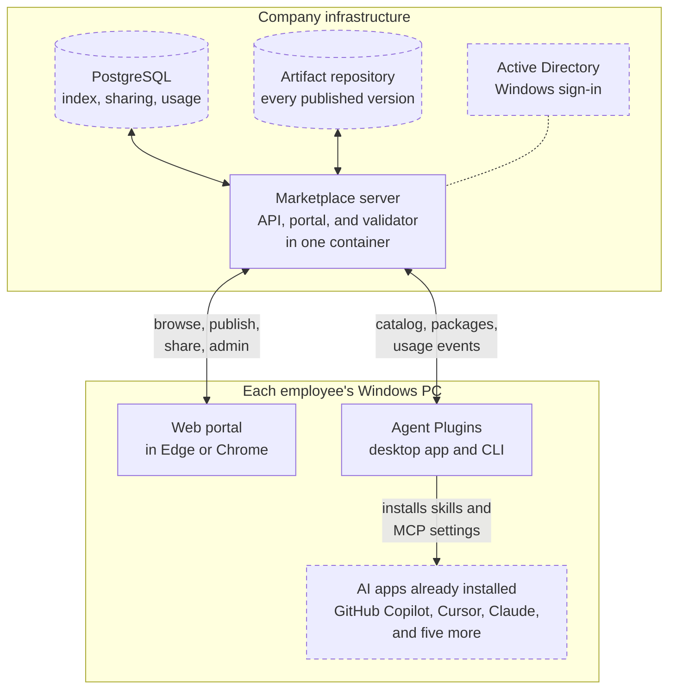
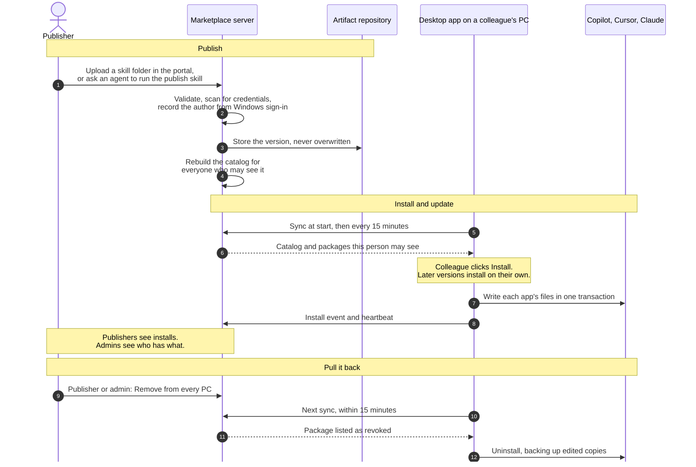
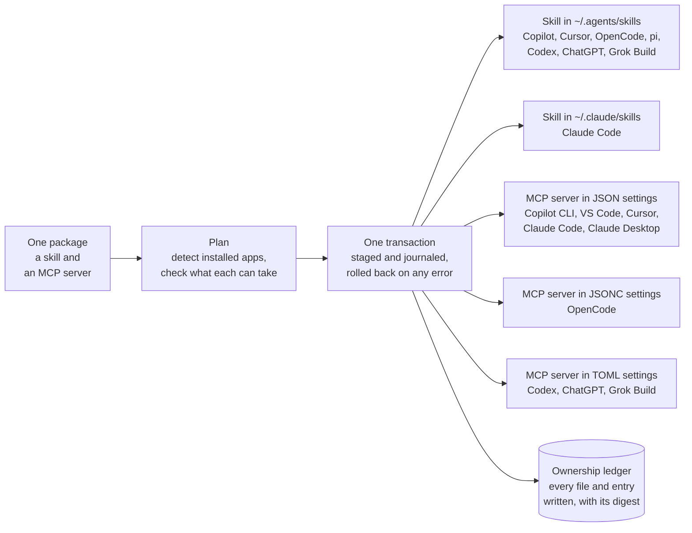
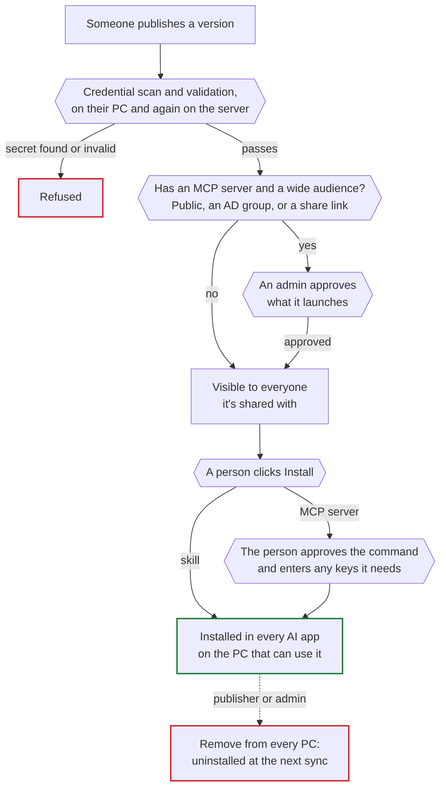

# Agent Plugins

Agent Plugins is an internal marketplace for the skills and MCP servers that AI coding assistants use. Anyone in the company publishes one from their desktop or browser, and anyone else installs it into GitHub Copilot, Cursor, and Claude from the portal or the app. The company runs the server, so identity, access, review, usage data, and the ability to pull a package back all stay in-house.

It has three parts: a Windows desktop app that installs packages into every AI app on the PC, a web portal for browsing, writing, publishing, and sharing, and a marketplace server the company hosts.

## What it distributes

AI assistants do better work when they know how the company works. Two kinds of package carry that knowledge, and a package can hold either or both:

- A **skill** is a folder with a `SKILL.md`, and optionally scripts or templates, that teaches an assistant one job: writing a migration the house way, triaging an incident, turning notes into a standup update.
- An **MCP server** connects an assistant to a system such as a ticket tracker, a database, or an internal API.

## Problems it solves

| Problem                                         | Without a marketplace                                                                                                                                                                      | With Agent Plugins                                                                                                                                                           |
| ----------------------------------------------- | ------------------------------------------------------------------------------------------------------------------------------------------------------------------------------------------ | ---------------------------------------------------------------------------------------------------------------------------------------------------------------------------- |
| Good skills stay with the person who wrote them | They live in one home folder, a wiki page, or a chat thread, and the copies drift apart.                                                                                                   | A skill is published once, found by search in the portal and the app, and updated on every PC that has it.                                                                   |
| Every AI app stores them differently            | Nine apps read skills from two folders and MCP servers from eight settings files in JSON, JSONC, and TOML, each with its own spelling. Many of the people who'd benefit aren't developers. | The app writes each AI app's own format in one transaction and records what it owns.                                                                                         |
| MCP servers run code with employees' access     | Nobody knows who runs what, and a bad one can't be recalled.                                                                                                                               | An MCP server shared widely waits for an admin, each person approves what it runs, and the owner or an admin can remove any package from every PC.                           |
| API keys end up in config files                 | Keys get pasted into settings files that are then shared.                                                                                                                                  | Publishing refuses anything that looks like a credential, on the PC and again on the server. Keys go into each person's own environment, never into a package or the server. |
| Nobody can see adoption                         | License counts show who has a seat, not who uses AI or which help is worth having.                                                                                                         | Active users over 1, 7, and 30 days, which AI apps people use, and the installs of every package.                                                                            |

## How it works



The company runs one container holding the API, the web portal, and the package validator. It keeps its index, sharing rules, and usage data in PostgreSQL, and every published version in an artifact repository. People sign in with their Windows logon through Active Directory, so nobody gets a new password and nobody needs an account in the artifact repository. Dashed boxes are things most companies already run.

On each PC, the desktop app syncs with the server when it starts and every 15 minutes after that, and installs what the person chose into every AI app it finds. The portal's **Install in Agent Plugins** button opens the app on the right package.

## The life of a skill



A version goes live as soon as it passes validation. There is no review queue, except that an admin approves an MCP server before it can reach a wide audience. A publisher can hand the work to an agent: the official `publish` skill has the agent find the skill folder, tighten its description, propose tags and a version, and publish it through the same checks. People without a skill folder write one in the portal instead. Colleagues who can see a package but don't own it suggest changes, which the owners accept or decline, much like a pull request.

## One install, every AI app



The desktop app plans each package against the AI apps it detects. It then stages every file and settings change, writes a recovery journal, and applies them together. An error rolls the whole install back, so a PC is never left half-changed. Settings files are edited in place, and every other key keeps its order, formatting, and comments. The ownership ledger lets the app update and remove exactly what it wrote and nothing else, and a file someone edited is never overwritten without a backup.

## Guardrails



| Control           | What it does                                                                                                                                                                                                                                                                    |
| ----------------- | ------------------------------------------------------------------------------------------------------------------------------------------------------------------------------------------------------------------------------------------------------------------------------- |
| Windows identity  | Every publish, share, and install is recorded under the person's Windows account, which comes from Kerberos and is never typed in.                                                                                                                                              |
| Credential scan   | The CLI and the server both refuse credential files, private keys, token-shaped strings, and secrets written into an MCP server's settings.                                                                                                                                     |
| One validator     | The desktop app, the CLI, and the server check packages with the same Rust code.                                                                                                                                                                                                |
| Visibility        | Personal and team spaces, packages, and bundles are public or private. Private means the owners plus a share list of people, teams, and optionally AD groups. A hidden package looks like it doesn't exist.                                                                     |
| MCP approval      | An admin approves what an MCP server launches before it can reach a wide audience (public, an AD group, or a share link), and again if a later version launches something else. Each person approves the command before it installs, and again when a later version changes it. |
| Kill switch       | **Remove from every PC** uninstalls a package from every running app at its next sync, within 15 minutes, and backs up copies people edited.                                                                                                                                    |
| Admin tools       | Block an account, purge a leaked version for good, hand a departed employee's space to a colleague, and export the audit log of every publish, share, review, and removal.                                                                                                      |
| No code execution | Agent Plugins writes files and settings and never runs package content. The AI app runs a skill's scripts or starts an MCP server, as it would for one set up by hand.                                                                                                          |

## What leaders see

The Admin page in the portal shows:

- active users over the last 1, 7, and 30 days;
- how many packages and publishers are live;
- which AI apps people use, and which app versions the fleet runs;
- the top packages, and for any package every PC that has it and at which version, exportable as CSV;
- startup check failures across the fleet over the last 7 days, so a proxy or clock problem shows up in one place;
- problem reports people filed.

Publishers see installs and the installed base of their own packages. Usage events carry package and AI app names, never project paths or file contents.

## Why not a shared repository or each vendor's team features

A shared Git repository of skills still leaves every person copying files into each AI app by hand, in each app's format, with no record of who has what and no way to pull a bad version back. Each AI vendor's team features cover that vendor's app, but people use several, and the same skill has to reach Copilot in VS Code, Cursor, and Claude Code. Agent Plugins sits underneath all of them, on infrastructure the company already runs.

## What a rollout takes

| Piece           | Requirement                                                                                                                                                                                                                                          |
| --------------- | ---------------------------------------------------------------------------------------------------------------------------------------------------------------------------------------------------------------------------------------------------- |
| Server          | One container image (the .NET 10 API, the portal, and the validator) behind the company's reverse proxy or ingress, with TLS. Database migrations run when it starts.                                                                                |
| Database        | PostgreSQL 16.                                                                                                                                                                                                                                       |
| Package storage | An artifact repository with a generic repository and one service account. Artifact Keeper is supported out of the box; storage sits behind a four-method interface, so another repository needs one small class.                                     |
| Sign-in         | An Active Directory service account with an SPN and a keytab.                                                                                                                                                                                        |
| PCs             | Windows 10 or 11 with the WebView2 runtime, which Windows 11 includes. The per-user installer needs no admin rights, and an MSI suits Intune and Configuration Manager. Registry policies point the app at the server and keep it starting at login. |
| Scale           | Designed for 50 users at launch and up to a few thousand, with search in the app sized for several thousand packages.                                                                                                                                |

[Roll out Agent Plugins in a company](docs/rollout-guide.md) walks through Kerberos, a production server, fleet policy, backups, and incident response.

## Supported AI apps

| App                                     | Skills                                                        | MCP servers                                       |
| --------------------------------------- | ------------------------------------------------------------- | ------------------------------------------------- |
| GitHub Copilot                          | Yes                                                           | Yes, for the Copilot CLI and each VS Code edition |
| Cursor                                  | Yes                                                           | Yes                                               |
| Claude Code                             | Yes                                                           | Yes                                               |
| Claude Desktop                          | No: Claude Desktop takes skills only from a claude.ai account | Local servers that read no environment variables  |
| OpenCode                                | Yes                                                           | Yes                                               |
| pi                                      | Yes                                                           | No: pi doesn't use MCP servers                    |
| Codex, and the ChatGPT app's Codex mode | Yes                                                           | Yes                                               |
| Grok Build                              | Yes                                                           | Yes                                               |

## Status

Agent Plugins is at version 0.2.2. The desktop app is built for Windows, and the marketplace server runs as a Linux container.

## Documentation

### Learn

- [Install your first package](docs/install-a-package.md) — from a fresh install to a skill your agent uses, and an MCP server after it.
- [Publish to the marketplace](docs/publish-to-marketplace.md) — publish a skill from your machine with the CLI or the `publish` skill.
- [Publish skills from CI](docs/publish-from-ci.md) — let a repository's pipeline publish what changed on every merge, with a plan on every pull request.
- [Publish a source](docs/publish-source.md) — write a portable package by hand and publish it as a zip.
- [Publish a source repository](docs/publish-source-repository.md) — publish a browseable catalog outside the marketplace server.

### Do

- [Troubleshooting](docs/troubleshoot.md) — a refused install, a skill an agent cannot see, a connector that does not work, a red **Status** button, an offline window.
- [Work on Agent Plugins](docs/development.md) — set up, verify, add an adapter, change a contract, run the server.
- [Roll out Agent Plugins in a company](docs/rollout-guide.md) — Kerberos, a production server, fleet policy for the desktop app, backups, and incidents.
- [Run the marketplace server](server/README.md) — configuration, Kerberos, Artifact Keeper, Docker.
- [Work on the web portal](website/README.md) — the Angular dev loop against a local server.

### Look up

- [App reference](docs/app-reference.md) — window and tray controls, notices and retries, package states, destinations, background behavior.
- [CLI reference](docs/cli-reference.md) — every command, its exit codes, and its JSON output.
- [Marketplace API](docs/marketplace-api.md) — endpoints, events, and configuration; [`server/openapi.json`](server/openapi.json) is generated.
- [Preflight checks](docs/preflight-reference.md) — every startup check, its status rules, and remediation.
- [Source manifest](docs/manifest-reference.md) — `agent-plugins.json`, `SKILL.md`, and MCP document fields.
- [Source repository](docs/source-repository-reference.md) — catalog document, locators, and identity.
- [Target adapter contract](docs/adapter-contract.md) — pinned target mappings.
- [Codebase map](docs/codebase-map.md) — what lives where, in Rust, React, and the server.

### Understand

- [Architecture](docs/architecture.md) — desired resources, transactions, ownership, trust, and the marketplace.
- [Native extension evaluation](docs/native-extensions-evaluation.md) — why hooks and in-process plugins stay out of the portable contract.
- [ADR 0001](docs/decisions/0001-multi-agent-desired-state.md) — product and migration decisions.
- [ADR 0002](docs/decisions/0002-source-repositories-and-locators.md) — catalogs and locators.
- [ADR 0003](docs/decisions/0003-artifact-only-catalog.md) — artifact-only distribution.
- [ADR 0004](docs/decisions/0004-internal-marketplace.md) — the marketplace server, Windows identity, metrics, and publishing.
- [ADR 0005](docs/decisions/0005-marketplace-access-control.md) — per-user and per-team access.
- [ADR 0006](docs/decisions/0006-web-portal-and-review.md) — the web portal and review before publishing.
- [ADR 0007](docs/decisions/0007-self-service-marketplace.md) — self-service teams, sharing, owner review, bundles, and installing from the website.
- [ADR 0008](docs/decisions/0008-primary-targets-and-connector-choices.md) — the primary apps, connector choices, and approvals that follow changes.

## Develop

Requirements: Rust, Node.js, pnpm, and the [Tauri platform prerequisites](https://v2.tauri.app/start/prerequisites/).

```bash
pnpm install
pnpm tauri dev
```

Run local verification before pushing:

```bash
pnpm typecheck && pnpm lint && pnpm test && pnpm format:check && pnpm build
pnpm --filter website lint && pnpm --filter website test && pnpm --filter website build
cargo fmt --manifest-path src-tauri/Cargo.toml --check
cargo clippy --manifest-path src-tauri/Cargo.toml --all-targets
cargo clippy --manifest-path src-tauri/Cargo.toml --no-default-features --features tools --bins -- -D warnings
cargo test --manifest-path src-tauri/Cargo.toml --all-targets
```

`pnpm install` also configures the tracked pre-commit hook, which runs both formatting checks before each commit.

[How to work on Agent Plugins](docs/development.md) covers the rest: throwaway state with `AGENT_PLUGINS_QA_ROOT`, adding a target adapter, changing the manifest contract, regenerating the schemas, and building and testing the marketplace server in `server/`.

## License

[MIT](LICENSE).
