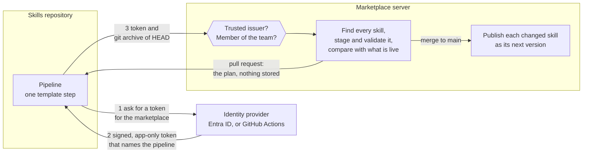
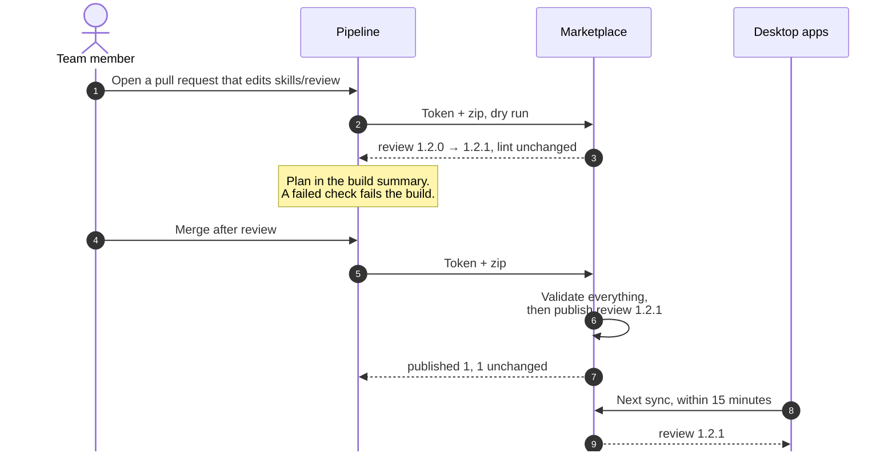

# Publish skills from CI

A team that keeps its skills in a Git repository can let its pipeline publish them. Every merge to `main` publishes the skills whose files changed, and every pull request shows what would publish. A team adds one pipeline file and adds the pipeline to their team once. They don't manage secrets or bump version numbers.

It works with Azure Pipelines and with GitHub Actions. The pipeline signs in with a short-lived token its own platform issues, and the marketplace checks each skill the same way it checks one published from the portal or the CLI.

## What a team gets

| Without it                                                                                           | With it                                                                                                                        |
| ---------------------------------------------------------------------------------------------------- | ------------------------------------------------------------------------------------------------------------------------------ |
| Someone publishes each skill by hand after a merge, and forgets one.                                 | The merge publishes every skill that changed. Skills that didn't change are left alone.                                        |
| A reviewer can't tell whether a pull request will pass the marketplace's checks until it has merged. | The pull request's build runs every check the real publish runs and shows the plan: which skills, which versions, which files. |
| Someone picks each version number, and two people pick the same one.                                 | The marketplace picks it: `1.0.0` for a new skill, the next patch for a changed one.                                           |
| A publish token sits in a pipeline variable, and nobody knows who else has copied it.                | There's no token to store. The pipeline's platform vouches for it on each run, and the token expires within the hour.          |
| One broken skill still lets the others ship, and the repository and the marketplace drift apart.     | Nothing publishes until every skill in the repository passes.                                                                  |

Pull request builds post a report like this to the build summary:

```text
### data-team: 2 to publish, 1 unchanged (dry run)

| Package   | Version         | Change                                                  |
| --------- | --------------- | ------------------------------------------------------- |
| review    | 1.2.0 → 1.2.1   | changed `skills/review/SKILL.md`, new `skills/review/checklist.md` |
| sql-style | 1.0.0 (new)     | 3 file(s)                                               |
| lint      | 1.0.4           | unchanged                                               |
```

## How it works



The pipeline sends one request with two things in it:

- **Who it is.** A token from its platform's identity provider, minted for the marketplace and valid for about an hour. On Azure Pipelines the token comes from Entra ID through a service connection. On GitHub Actions it is the workflow's own OIDC token. The marketplace checks the token's signature, issuer, and audience, then names the caller after the claim that identifies the pipeline: `app:<object ID>` for an Entra service principal, `github:<owner>/<repo>` for a GitHub repository.
- **What it has.** `git archive` of the commit being built, as a zip. That includes only committed files, and nothing marked `export-ignore` in `.gitattributes`.

The marketplace does the rest, so the pipeline step is the same small script on every platform:

1. It checks that the pipeline is a member of the team it publishes to.
2. It finds every package in the zip (see [what counts as a skill](#what-counts-as-a-skill)).
3. It stages each one exactly as `agent-plugins publish` would, runs the validator and the credential scan, and compares the files with the live version.
4. On a dry run, it stops and returns the plan. Otherwise, if every package passed, it publishes each changed one.

## A change from pull request to live



## Versions

The marketplace picks every version, so the repository holds no version numbers.

| The skill in the repository                    | What publishes                                                          |
| ---------------------------------------------- | ----------------------------------------------------------------------- |
| Isn't in the marketplace yet                   | `1.0.0`.                                                                |
| Has the same files as the live version         | Nothing. Running the same commit again changes nothing.                 |
| Has different files from the live version      | The patch after the highest version ever used: `1.2.0` becomes `1.2.1`. |
| Was published from the portal or CLI meanwhile | The repository's files, as the next patch. The repository wins.         |

Skills don't depend on each other, and there is no version solving, so a patch number is all a desktop app needs to know that something is newer. The commit's subject line becomes the version's changelog.

A skill that's in the marketplace but not in the repository is listed at the end of the report as left as it is. CI never withdraws or removes anything. Do that from the portal.

## What counts as a skill

The marketplace looks through the zip in one of two ways:

- **With `agent-plugins.json` at the top**, it publishes each package the manifest declares, and nothing else in the repository. Use this to group skills into one package, to add an MCP server, or to name packages yourself. See [the source manifest reference](manifest-reference.md).
- **Without one**, every folder that holds a `SKILL.md` is a package of its own, named after the `name:` in its header. It searches every folder, including `.claude/skills`, `.github/skills`, and `.agents/skills`, and skips tool leftovers such as `node_modules`. A skill's own subfolders belong to it, so an `examples/` folder inside a skill is never a second skill.

Each package is staged the way `agent-plugins publish` stages it. A `<team>-` prefix on a skill's name is dropped, because installed skills are already named `<team>-<skill>`.

Two skills with the same name, or a `SKILL.md` whose header doesn't parse, fail the run and name the folder. To publish only part of a repository, set the template's `path` to the folder that holds the skills.

## Who can publish

A pipeline publishes as its own account, never as a person. That account can do much less than a person's:

| A pipeline account                                                   | Why                                                                                                                  |
| -------------------------------------------------------------------- | -------------------------------------------------------------------------------------------------------------------- |
| Publishes only to teams it is a member of                            | A team owner adds it, like a person. Removing it stops the next run.                                                 |
| Can only read and publish                                            | It can't share, withdraw, remove, delete, create a team, or change members. Those take a person signed in.           |
| Is never an admin, and has no personal space                         | An admin list that happens to name it grants nothing.                                                                |
| Matches team members, share lists, and blocks only by its exact name | The rule that lets `CORP\jane` match `jane@corp.example` doesn't apply, so a person's entry never covers a pipeline. |
| Can be blocked by an admin                                           | A blocked pipeline can still read but can't publish. This is the kill switch for a pipeline that misbehaves.         |
| Is recorded as the publisher of each version                         | The package page and the audit log show `github:acme/skills` or `app:3f2a…` next to the version.                     |
| Signs in only with app-only tokens                                   | A token that carries scopes belongs to a person signed in to some app, and it is refused.                            |

The marketplace trusts only the issuers its admins list in [`Auth:Machines`](#server-configuration), and only tokens minted for its own audience. That means a token meant for Azure, or for another service, doesn't work here.

A pull request build uses the same account as the merge build, so anyone who can run the pipeline on a branch can publish from that branch. That is no more than the team already has: its members can publish from their own PCs. To make `main` the only branch that publishes, see [Only publish from main](#only-publish-from-main).

## Set it up on Azure DevOps

> The Azure DevOps template follows Microsoft's documented service connection flow, but it hasn't yet been run against a real Entra tenant. The GitHub Actions path has been run end to end.

The marketplace admins do step 1 once. Each team does the rest.

1. **Register the marketplace in Entra ID** (admins, once). Create an app registration for the marketplace. Give it an Application ID URI such as `api://agent-plugins-marketplace`, and set its accepted access token version to 2 (`requestedAccessTokenVersion: 2` in the manifest). Then add it to [`Auth:Machines`](#server-configuration), and set the template's `marketplace` and `audience` defaults in `ci/publish-skills/azure-pipelines.yml` to the company's values.

2. **Create a service connection** in the skills repository's project: **Project settings > Service connections > New > Azure Resource Manager > Workload identity federation**. Name it, for example `skills-publish`, and allow the skills pipeline to use it. The marketplace needs nothing from it but a token, so give its identity the least Azure access your organization's service connection rules allow.

3. **Add the pipeline** as `azure-pipelines.yml` in the skills repository:

   ```yaml
   trigger: [main]

   resources:
     repositories:
       - repository: agent-plugins
         type: git
         name: <project>/agent-plugins

   pool:
     vmImage: ubuntu-latest

   steps:
     - template: ci/publish-skills/azure-pipelines.yml@agent-plugins
       parameters:
         namespace: data-team
         serviceConnection: skills-publish
   ```

   Windows agents work too: the step runs in PowerShell 7 and uses `curl.exe`.

4. **Run it once.** It fails and names the pipeline's account:

   ```text
   HTTP 403: app:3f2a7c1e-… is not a member of data-team. An owner of data-team adds app:3f2a7c1e-… under Members on the team's page in the marketplace, then this pipeline can publish there.
   ```

   A team owner opens the team's page in the portal, types the account under **Add people** (the pipeline is in the directory once it has run), and adds it. Run the pipeline again.

5. **Check pull requests.** Azure Repos runs pull request builds through branch policy, not the `pr:` keyword. Open **Repos > Branches > main > Branch policies > Build validation**, and add the pipeline. Pull request builds are dry runs automatically.

Template parameters:

| Parameter           | Default                           | Meaning                                                                   |
| ------------------- | --------------------------------- | ------------------------------------------------------------------------- |
| `namespace`         | required                          | The team to publish to.                                                   |
| `serviceConnection` | required                          | The workload identity federation service connection.                      |
| `marketplace`       | the company marketplace           | The marketplace URL.                                                      |
| `audience`          | `api://agent-plugins-marketplace` | The marketplace's Application ID URI in Entra ID.                         |
| `path`              | `.`                               | The folder to publish, relative to the repository root.                   |
| `dryRun`            | `auto`                            | `auto` is a dry run for pull request builds. `true` or `false` forces it. |

## Set it up on GitHub Actions

1. **Trust GitHub** (admins, once): add GitHub's issuer to [`Auth:Machines`](#server-configuration), with the marketplace's URL as the audience.

2. **Add the workflow** as `.github/workflows/publish-skills.yml`:

   ```yaml
   name: Publish skills
   on:
     push:
       branches: [main]
     pull_request:

   permissions:
     contents: read
     id-token: write

   jobs:
     publish:
       runs-on: ubuntu-latest
       steps:
         - uses: actions/checkout@v4
         - uses: jacobragsdale/agent-plugins/ci/publish-skills@main
           with:
             marketplace: https://marketplace.example.com
             namespace: data-team
   ```

   `id-token: write` lets the job ask GitHub for a token. GitHub never gives one to a pull request from a fork, so forks can't publish or dry-run.

   If the marketplace can only be reached from inside your network, run the job on a self-hosted runner there (`runs-on: self-hosted`). GitHub issues the token all the same.

3. **Run it once**, and add the account it names, `github:<owner>/<repo>`, to the team the same way.

Action inputs: `marketplace` and `namespace` (required), `path` (default `.`), `dry-run` (default `auto`, a dry run for `pull_request` events), and `audience` (default: the marketplace URL).

## Only publish from main

By default, any run of the pipeline can publish, including a pull request build whose YAML was edited. To make only `main` publish:

- **Azure DevOps:** add a **Branch control** check to the service connection that allows only `refs/heads/main`. Pull request builds then can't get a token, so they lose the dry run. Run `agent-plugins validate` locally, or accept that the plan appears only after merge.
- **GitHub:** run the publish job in an environment limited to `main`, and set the GitHub issuer's `AccountClaim` to `sub`. The account then reads `github:repo:<owner>/<repo>:environment:<name>`, which only jobs in that environment get. Add that account to the team instead.

## Server configuration

Each entry in `Auth:Machines` trusts one issuer. Every setting can also be an environment variable, such as `Auth__Machines__0__Authority`.

| Setting        | Meaning                                                                                                                                                               |
| -------------- | --------------------------------------------------------------------------------------------------------------------------------------------------------------------- |
| `Authority`    | The issuer. The marketplace reads its signing keys from `<Authority>/.well-known/openid-configuration`, so the server needs HTTPS access to it.                       |
| `Audience`     | The audience tokens must carry. For Entra ID with version 2 tokens, this is the marketplace app's Application (client) ID. For GitHub, the URL the workflow asks for. |
| `AccountClaim` | The claim that names the pipeline: `oid` on Entra ID, `repository` on GitHub.                                                                                         |
| `Prefix`       | Put in front of the claim's value, so a pipeline's account never looks like a person's: `app:` or `github:`.                                                          |

```json
{
  "Auth": {
    "Machines": [
      { "Authority": "https://login.microsoftonline.com/<tenant-id>/v2.0", "Audience": "<marketplace app's client ID>", "AccountClaim": "oid", "Prefix": "app:" },
      { "Authority": "https://token.actions.githubusercontent.com", "Audience": "https://marketplace.example.com", "AccountClaim": "repository", "Prefix": "github:" }
    ]
  }
}
```

A `Bearer` token goes to the entry whose `Authority` matches the token's issuer. `GET /api/health` lists `Bearer` among its schemes when at least one entry is set. Without entries, bearer tokens are ignored and nothing else changes.

## When a run fails

The pipeline log and summary say what went wrong. The common cases:

| Message                                                                        | What to do                                                                                                                          |
| ------------------------------------------------------------------------------ | ----------------------------------------------------------------------------------------------------------------------------------- |
| `… is not a member of data-team. An owner of data-team adds …`                 | Add the account it names to the team in the portal.                                                                                 |
| `The token was minted for X, not Y.`                                           | The pipeline asked for the wrong audience. Fix the template's `audience`, or the server's `Audience`.                               |
| `The token comes from X, which this marketplace does not trust.`               | The issuer isn't in `Auth:Machines`. Ask the marketplace admins.                                                                    |
| `This token belongs to a person.`                                              | The token was issued for a person, not the service connection. Use the service connection's own identity.                           |
| `The job can't sign in to the marketplace. Add 'permissions: id-token: write'` | GitHub only. Add the permission to the job.                                                                                         |
| `Some skills failed the marketplace's checks.`                                 | The summary names each folder and what's wrong with it, the same messages `agent-plugins validate` prints. Fix them and push again. |
| `A CI pipeline can only publish.`                                              | The pipeline tried something else, such as sharing. Do that from the portal.                                                        |
| `HTTP 413: The repository is larger than the 50 MB limit.`                     | Set `path` to the folder that holds the skills, or mark the rest `export-ignore` in `.gitattributes`.                               |
| `HTTP 429: Too many changes in a short time.`                                  | The pipeline ran more than `RateLimits:UploadsPerHour` times in an hour. Wait for the time it gives.                                |

A run that failed partway through publishing, for example because another publish took the same version number at the same moment, can be run again. It publishes only what is still different.

## Why it works this way

| Choice                                                       | Instead of                                               | Because                                                                                                                                                                                           |
| ------------------------------------------------------------ | -------------------------------------------------------- | ------------------------------------------------------------------------------------------------------------------------------------------------------------------------------------------------- |
| Tokens from the pipeline's own identity provider             | A publish token the marketplace issues and a team stores | Nothing long-lived to paste, rotate, or leak. PyPI, npm, crates.io, and NuGet moved to the same model.                                                                                            |
| An Entra token through a service connection, on Azure DevOps | The Azure DevOps OIDC token itself                       | Azure DevOps always mints its token for Entra ID, so a marketplace that accepted it would accept any token the organization mints for Azure. The Entra token is minted for the marketplace alone. |
| The pipeline as a team member                                | A separate list of trusted repositories per team         | Teams, the portal's member list, blocks, and the audit log already exist, and a refused run says exactly which account to add.                                                                    |
| The marketplace picks versions                               | Git tags or a version in each skill                      | A skill has no dependents to break, so a number people must remember to bump buys nothing. Unchanged skills are skipped, so a rerun is always safe.                                               |
| One request with the whole repository                        | A loop in the pipeline that publishes each skill         | Finding, validating, and comparing happen once, on the server, with the same code as every other publish. The pipeline step stays short and identical on each platform.                           |
| All or nothing                                               | Publishing whatever passed                               | The marketplace never holds half of a change that spans two skills.                                                                                                                               |

See [the API reference](marketplace-api.md#post-apinamespacesnamespacepublish) for the request itself, and [Publish to the marketplace](publish-to-marketplace.md) for publishing by hand.
